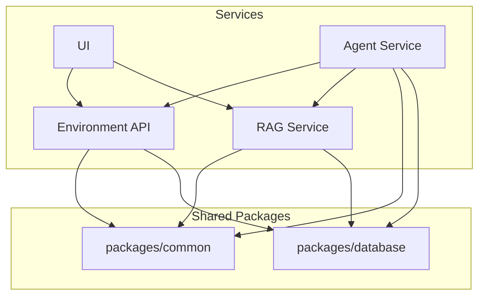

# BeliefCraft

**BeliefCraft** is a research-oriented toolkit that uses retrieval-augmented generation as a knowledge model to improve belief/state estimation and decision making in partially observable environments. It combines document retrieval with provenance-aware passages, particle-based or learned belief updates, and policy learners (actor-critic / PPO) so agents can make more informed, auditable decisions. The project delivers an end-to-end pipeline: ingest and index domain texts, expose a RAG API, augment agent beliefs at runtime, and evaluate decision performance in controlled simulations.

**Architecture**

**Repo Layout**
- `services/`: deployable services (isolated dependencies per service)
- `services/environment-api/`: FastAPI service for environments
- `services/rag-service/`: FastAPI service for retrieval
- `services/agent-service/`: FastAPI service for agents
- `services/ui/`: Vite + React UI shell
- `packages/common/`: shared schemas and utilities
- `packages/database/`: shared database models and connection helpers
- `infrastructure/`: Docker and scripts
- `docs/`: design docs
- `tests/`: test suites

**Quick Start**
1. Copy each service env example to a local `.env` file.
2. Build and start all services with `docker compose up --build`.
3. Verify health checks.

Service endpoints (host ports):
- Environment API: `http://localhost:8000/healthz`
- RAG Service: `http://localhost:8001/healthz`
- Agent Service: `http://localhost:8002/healthz`
- UI: `http://localhost:3000/`

**Development Notes**
- Python services use `uv` for dependency management with `pyproject.toml`.
- Each service keeps its own `pyproject.toml` or `package.json` for isolated dependencies.
- Docker Compose runs everything from the repo root via `docker-compose.yml`.
