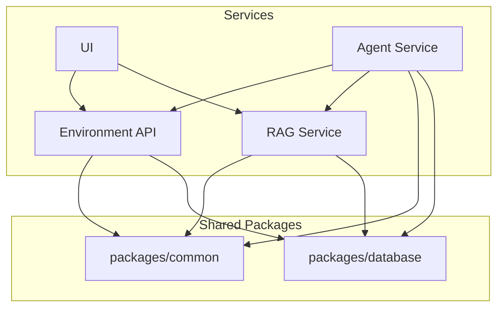

# BeliefCraft

**BeliefCraft** is a research-oriented toolkit that uses retrieval-augmented generation as a knowledge model to improve belief/state estimation and decision making in partially observable environments. It combines document retrieval with provenance-aware passages, particle-based or learned belief updates, and policy learners (actor-critic / PPO) so agents can make more informed, auditable decisions. The project delivers an end-to-end pipeline: ingest and index domain texts, expose a RAG API, augment agent beliefs at runtime, and evaluate decision performance in controlled simulations.

**Architecture**

**Repo Layout**
- `services/`: deployable services (isolated dependencies per service)
- `services/environment-api/`: FastAPI service for environments
- `services/rag-service/`: FastAPI service for retrieval
- `services/agent-service/`: FastAPI service for agents
- `services/ui/`: Vite + React UI shell
- `packages/common/`: shared schemas and utilities
- `packages/database/`: shared database models and connection helpers
- `infrastructure/`: Docker and scripts
- `docs/`: design docs
  - `docs/configuration-workflow.md`: YAML config loading, validation, and env placeholder expansion
- `tests/`: test suites

**Quick Start**
1. Copy env templates:
  - `cp .env.example .env`
  - `cp services/environment-api/.env.example services/environment-api/.env`
  - `cp services/rag-service/.env.example services/rag-service/.env`
  - `cp services/agent-service/.env.example services/agent-service/.env`
  - `cp services/ui/.env.example services/ui/.env`
2. Install local dependencies for all services with `make setup`.
3. Start development mode with hot reload using `make dev`.
4. Verify stack health with `powershell -ExecutionPolicy Bypass -File infrastructure/scripts/health/check-services.ps1`.

Service health endpoints (host ports):
- Environment API: `http://localhost:8000/health`
- RAG Service: `http://localhost:8001/health`
- Agent Service: `http://localhost:8003/health`
- UI: `http://localhost:3000/health`

**Make Commands**
- `make setup` - install all Python and UI dependencies
- `make dev` - run full Docker Compose stack in development mode
- `make test` - run test suite
- `make lint` - run linters
- `make format` - auto-format code
- `make clean` - remove containers, networks, and volumes

**Database Startup Flow**
- PostgreSQL starts with initialization script at `infrastructure/scripts/postgres/init-databases.sh`.
- Databases are created automatically (`environment_api`, `rag_service`).
- Migration container `db-migrate` applies SQL files from `infrastructure/scripts/postgres/migrations` before API services start.

**Troubleshooting**
- Common issues and fixes are documented in `docs/troubleshooting.md`.

**Development Notes**
- Python services use `uv` for dependency management with `pyproject.toml`.
- Each service keeps its own `pyproject.toml` or `package.json` for isolated dependencies.
- Docker Compose runs everything from the repo root via `docker-compose.yml`.
