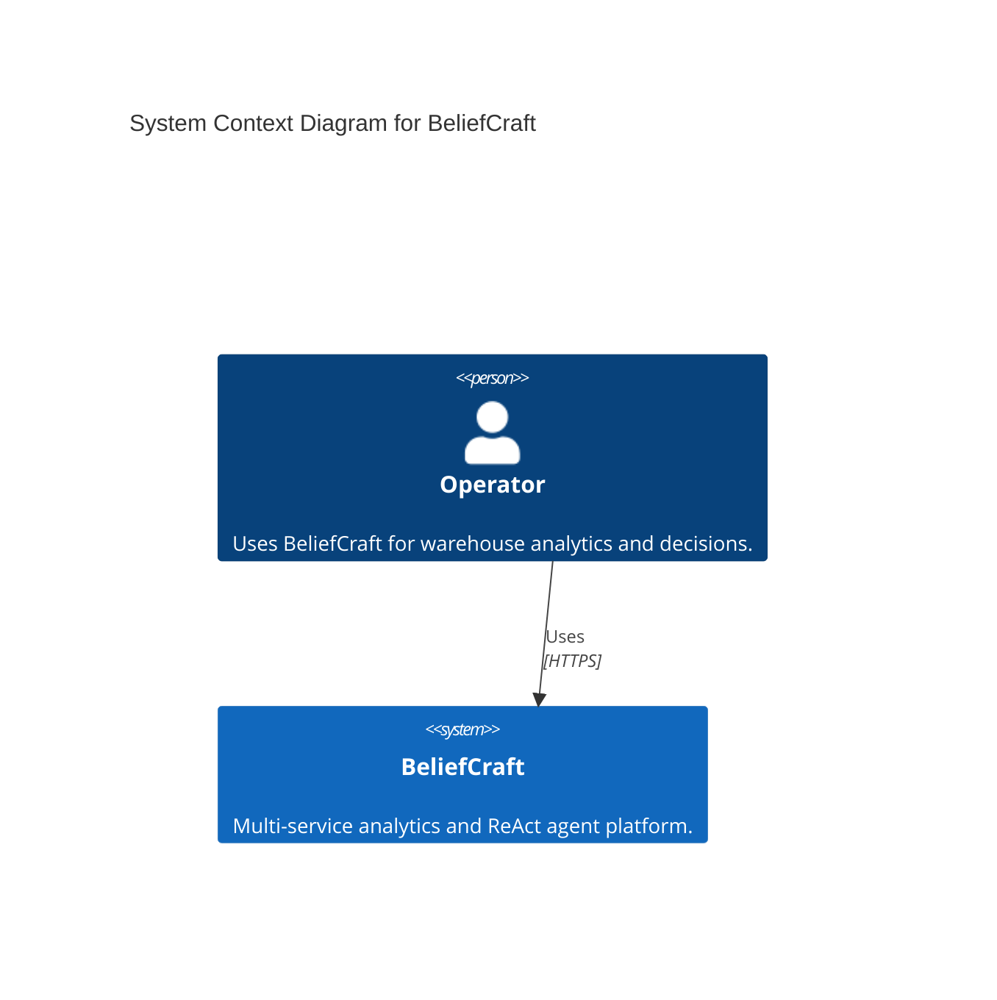
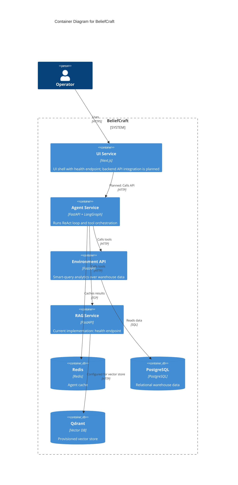
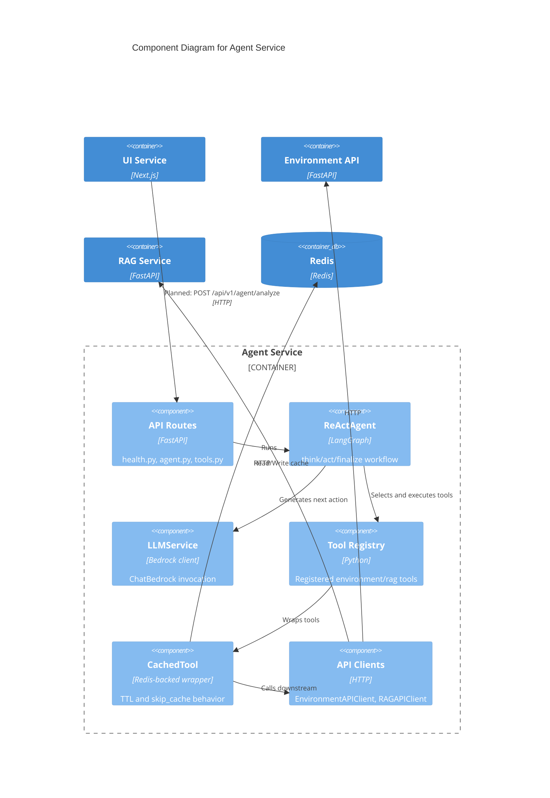

# C4 Model Diagrams: BeliefCraft System

This document contains C4-style Mermaid diagrams aligned with the current repository implementation.

## Level 1: System Context Diagram

## Level 2: Container Diagram

Current-state note:
- UI-to-agent business API calls are planned and shown as target architecture; current UI code implements health and middleware only.

## Level 3: Component Diagram (Agent Service)

